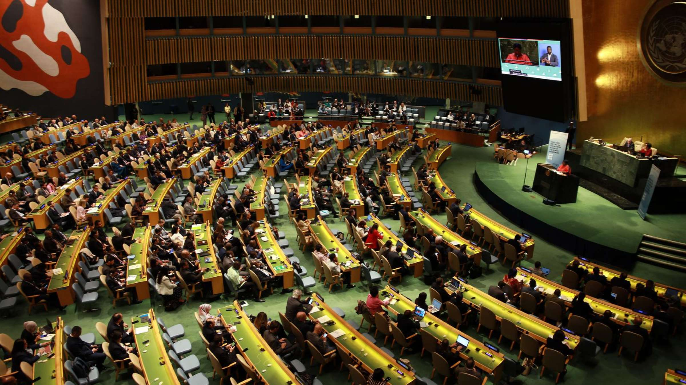

```{r echo=FALSE, warning=FALSE}
#remotes::install_github("ropensci/RefManageR")
library(RefManageR) 
BibOptions(check.entries = FALSE,
           bib.style = "authoryear",
           cite.style = "authoryear",
           style = "markdown",
           hyperlink = TRUE,
           dashed = FALSE,
           no.print.fields=c("doi", "url", "urldate", "issn"))
myBib <- ReadBib("bib_group_pres.bib", check = FALSE)
```

```{r xaringan-all, echo=FALSE, warning=FALSE, include=FALSE}

library(readxl)
library(dplyr)
library(xaringan)
library(xaringanExtra)
library(knitr)
library(knitcitations)
library(xaringanthemer)

hook_source <- knitr::knit_hooks$get('source')
knitr::knit_hooks$set(source = function(x, options) {
  x <- stringr::str_replace(x, "^[[:blank:]]?([^*].+?)[[:blank:]]*#<<[[:blank:]]*$", "*\\1")
  hook_source(x, options)
})

xaringanExtra::use_broadcast()
xaringanExtra::use_freezeframe()
xaringanExtra::use_scribble()
#xaringanExtra::use_slide_tone()
xaringanExtra::use_search(show_icon = TRUE, auto_search	=FALSE)
xaringanExtra::use_freezeframe()
xaringanExtra::use_clipboard()
xaringanExtra::use_tile_view()
xaringanExtra::use_panelset()
xaringanExtra::use_editable(expires = 1)
xaringanExtra::use_fit_screen()
xaringanExtra::use_extra_styles(
  hover_code_line = TRUE,         
  mute_unhighlighted_code = TRUE  
)

```

```{r xaringan-themer, include=FALSE, warning=FALSE}
style_mono_accent(
  base_color = "#399cbd",
  header_font_google = google_font("Josefin Sans"),
  text_font_google   = google_font("Montserrat", "300", "300i"),
  code_font_google   = google_font("Fira Mono")
)

```

```{r xaringan-all, echo=FALSE, warning=FALSE, out.width="100%"}
```

## Highlighting the problem 


.panelset[

.panel[.panel-name[Highlight]

.pull-left[ 

```{r echo=FALSE,fig.cap=''}

```
<span style="font-size: 11pt;"> `r Citet(myBib,"ploutarchostzampoglouWaterFreeFullText2023")`. 

]

.pull-right[ 
* Jakarta, **located in a lowland delta area** with close to **50% below regional water level, is vulnerable to coastal** and **river flooding due to monsoons, sea-level rise** and **insufficient** and **faulty drainage infrastructure** `r Citep(myBib,"c40citiesC40GoodPractice2016")`. 

* An estimated **90% of North Jakarta is expected to lie below sea level in 2030** `r Citep(myBib,"c40citiesC40GoodPractice2016")`.


 ] 

]

.panel[.panel-name[The Problem]

* The rapid rates of **land subsidence** play a key role in **relative sea- level rise**: estimates suggest an average subsidence rate of 40 mm/year, in some places up to 20 cm/year.

* As the **sea-level rises, saltwater intrusion of groundwater tables** also becomes a problem.

* Currently, detailed understanding of the **characteristics and mechanisms of land subsidence** in Jakarta, both **spatially and temporally**, remains incomplete `r Citep(myBib,"abidinStudyRiskImpacts2015")`. 

.panel[.panel-name[Existing Policy]

.pull-left[ 

<span style="font-size: 12pt;">  To protect Jakarta from coastal flooding, **the National Capital Integrated Coastal Development (NCICD) under their Master Plan** was proposed, with the main plan surrounding the construction of seawall which could reach 32km in length `r Citep(myBib,"indonesiainvestmentsGiantSeaWall")`.

   

]
.pull-right[

**Limitations to this policy:**


* Seawall requires frequent maintenance due to coastal erosion. `r Citep(myBib,"nunnSeawallsMaladaptationsIsland2021")`.

* Only provides coastal defense than solving the root cause (land subsidence).

* Creates conflict with dynamic coastal nature and blocks sediment exchange between land and sea.

* Disrupts shoreline processes and ruins coastal habitats and ecosystems `r Citep(myBib,"falashifahGIANTSEAWALL2021")`.  

]
]

```{r echo=FALSE, out.width="50%", fig.align='center',fig.cap=''}

```
<span style="font-size: 11pt;"> From: `r Citet(myBib,"abidinStudyRiskImpacts2015a")`
]
]

---
# The significance of Jakarta

.panelset.sideways[

.panel[.panel-name[Jakarta as capital]

* Jakarta is home to significant financial institutions like the Indonesia Stock Exchange and the Bank of Indonesia.

* It also serves as the corporate headquarters for numerous Indonesian companies and multinational corporations. This underscores its pivotal role in the country's economy `r Citep(myBib,"julianagunawanBuildingIndonesiaResilience2016")`.
 

```{r echo=FALSE, out.width="70%",fig.align='center'}

```

]

.panel[.panel-name[Area]

* Jakarta is located in West Indonesia, on the island of Java. 

* The area of Jakarta is 661.5km2 and is divided to five administrative cities of South Jakarta, Central Jakarta, East Jakarta, West Jakarta, and North Jakarta.
```{r echo=FALSE, out.width="45%", fig.align='center',fig.cap=''}

```
]

.panel[.panel-name[Population]

* Total population is 10 million within the city, while the total population of the entire metro area is 30 million. 

* This makes it the second largest mega city in the world. 

```{r echo=FALSE, out.width="75%", fig.align='center',fig.cap=''}

```
<span style="font-size: 12pt;"> From: `r Citet(myBib,"sabinFreeStreetsWorld2023")`

]
]

  
---

```{r echo=FALSE, fig.width=5, warning=FALSE}
```

## Causes of Subsidence

.pull-left[
* Physical factors: natural sediment compaction/ consolidation of alluvium soil and earthquakes. Indonesia is located on destructive plate boundaries where earthquakes happen frequently `r Citep(myBib,"bottLandSubsidenceJakarta2021")`.

* Human/ social factors: groundwater extraction, rapid urban development, improper agricultural practices `r Citep(myBib,"abidinLandSubsidenceJakarta2011")`. 


]


.pull-right[


<span style="font-size: 12pt;"> From: `r Citet(myBib,"sheryltiantongleeJakartaIndonesiaCapital2023")`
]


---
```{r xaringan-all, echo=FALSE, warning=FALSE}
```

## Impact of land subsidence  

.panelset[

.panel[.panel-name[Social]

* Possibility of seawater intrusion to the lowered groundwater table, thus lack of clean water supply

* Disturbance of people daily activities.

* Damage of infrastructure


`r Citet(myBib,"ohenhenSlowlySurelyExposure2024")`
`r Citet(myBib,"abidinEnvironmentalImpactsLand2015")`
]

.panel[.panel-name[Economic]

* Enlarge of infrastructure maintenance cost.

* Reduction in land and property values.

* Buildings and facilities Abandonment.

* Disruption of economic activities.

`r Citet(myBib,"arieldinarLandSubsidenceForgotten2018")`


]

.panel[.panel-name[Environment]


* Frequent coastal flooding.

* Inundated areas and infrastructures.

* Increasing the risks of inland sea water intrusion.

* Negative impacts on local ecosystem and biodiversity.

`r Citet(myBib,"abidinEnvironmentalImpactsLand2015")`

]


]

---
## Benefits of our proposed project

* To produce enhanced and comprehensive information on land subsidence.

* To provide solutions to different aspects of the NCICD master plan -- enhancing flood safety, land reclamation, and reinforcement of infrastructure. 

* To incorporate the global agendas and goals into regional development as promised during the UN meetings.

```{r echo=FALSE, out.width="60%", fig.align='center'}

```

---

## Global agendas and goals 1
###  The Sendai Framework for Disaster Risk Reduction (2015)

.pull-left[

```{r echo=FALSE, out.width="80%"}
knitr::include_graphics("SendaiFramrwork.jpeg")
```

]
.pull-right[


* To understand disaster risks induced by land subsidence.

* To reduce vulnerability of coastal regions by enhancing resilience capacity e.g., preparedness and awareness to disasters. 

* To strengthen local governance towards disaster risks management.

* **Recognises the state has the primary role for DRR.**


]
<small>Source: [Implementing the Sendai Framework](https://www.undrr.org/implementing-sendai-framework/what-sendai-framework)</small>
---
## Global agendas and goals 2
### Sustainable Development Goals (SDGs)
.panelset[
.panel[.panel-name[SDG 6]

.pull-left[

```{r echo=FALSE, out.width="50%", fig.align= "center"}
knitr::include_graphics("E_PRINT_06.jpg")
```

<small> **Target 6.4**
By 2030, substantially increase water-use efficiency across all sectors and ensure sustainable withdrawals and supply of freshwater to address water scarcity and substantially reduce the number of people suffering from water scarcity </small>
]
.pull-right[

By addressing land subsidence, we can...

* Avoid seawater intrusion to groundwater table.

* Ensure clean groundwater supply be accessible and available to everyone

]


]

.panel[.panel-name[SDG 11]
.pull-left[

```{r echo=FALSE, out.width="50%", fig.align= "center"}
knitr::include_graphics("E_PRINT_11.jpg")
```

<small>**Target 11.3**
By 2030, enhance inclusive and sustainable urbanization and capacity for participatory, integrated and sustainable human settlement planning and management in all countries. </small>
]
.pull-right[

By addressing land subsidence, we can...

* Protect local communities and businesses from disasters and risks.

* Reduce exposure of local communities from land subsidence while sustaining urbanisation. 
]


]

.panel[.panel-name[SDG 15]
.pull-left[
```{r echo=FALSE, out.width="50%", fig.align= "center"}
knitr::include_graphics("E_PRINT_15.jpg")
```

<small>**Target 15.3**
By 2030, combat desertification, restore degraded land and soil, including land affected by desertification, drought and floods, and strive to achieve a land degradation-neutral world. </small>
]
.pull-right[

By addressing land subsidence, we can...

* Reduce damage to infrastructure such as roads and buildings.

* Reduce flood risk in terms of extent.

* Mitigate negative impacts on local (coastal) ecosystem. 

]
]
]
<small>Source: [The 17 Goals | Sustainable Development](https://sdgs.un.org/goals)</small>
---
```{r xaringan-all, echo=FALSE, warning=FALSE}
```

## Objectives

- Support the National Capital Integrated Coastal Development Project by providing data-driven monitoring and improved decision-making on land subsidence.

  - Producing a land subsidence susceptibility map for better monitoring
  - Producing a land subsidence risk map to help tackle problem areas
  
- Using these products:

  - Identify areas that require careful monitoring.
  - Provide evidence-based recommended action on sustainable water management and infrastructure zoning.
  - Comply with relevant national and international policies to intervene as appropriate. 


---
## Methodology: Workflow

```{r echo=FALSE, out.width='100%', fig.align='center', fig.cap=''}


```

---
## Data

.panelset[
.panel[.panel-name[Environmental]

```{r echo=FALSE, message=FALSE, warning=FALSE}
library(tidyverse)
library(knitr)
library(readxl)
library(kableExtra)
library(here)

cond <- read_excel(here("Conditional_factors.xlsx"))


# Display the table using kableExtra with styling
cond %>%
  
  knitr::kable(format = 'html')%>%
  kable_styling(full_width = FALSE, font_size = 13.5)
```
]

.panel[.panel-name[Previous Land Subsidence]
```{r echo=FALSE, message=TRUE, warning=TRUE}
hist <- read_excel("Historical_LS.xlsx")


# Display the table using kableExtra with styling
hist %>%
  knitr::kable(format = 'html') %>%
  kable_styling(full_width = FALSE, font_size = 16)
```
]

.panel[.panel-name[Social]
```{r echo=FALSE, message=FALSE, warning=FALSE}
socioecon <- read_excel("Socio_economic.xlsx")


# Display the table using kableExtra with styling
socioecon %>%
  knitr::kable(format = 'html') %>%
  kable_styling(full_width = FALSE, font_size = 16)
```
]
]
---
## Methodology: Susceptibility Mapping

1. Split the remotely sensed data on previous land subsidence and influential environmental factors into training (70%) and testing (30%).

1. Preprocess the data including building raster maps for each variable. 

1. Employ Random Forest algorithm with cross validation to map land subsidence susceptibility.

1. Validate the model using the testing data. 

1. Perform a permutation feature importance analysis to measure the contribution of each feature to the model.

1. Map out land subsidence susceptibility that identifies areas of very low, low, moderate, high and very high susceptibility `r Citep(myBib,"eghrariLANDSUBSIDENCESUSCEPTIBILITY2023")`. 


---
```{r echo=FALSE, out.width='90%', fig.align='bottom', fig.cap=''}

```

## Methodology: Risk Mapping 

1. Preprocess land subsidence and social data to create raster maps.

1. Use Analytical Hierarchical Process (AHP) to calculate relative weights on both the land subsidence data and social data to indicate hazard and vulnerability. 

1. Produce hazard and vulnerability maps using the calculated weights. 

1. Combine hazard and vulnerability maps by producing a risk index.

1. Using risk index, produce a risk map showing areas at very low risk, low risk, moderate risk, high risk and very high risk `r Citep(myBib,"bhattaraiRiskAssessmentLand2017")`. 


---
## Example Outputs

.pull-left[

**Susceptibility Map** 

```{r echo=FALSE, out.width='90%', fig.align='center', fig.cap=''}


```

<span style="font-size: 12pt;"> Source: `r Citet(myBib,"gharechaeeLandSubsidenceSusceptibility2023")`

]

.pull-right[

**Risk Map** 

```{r echo=FALSE, out.width='87%', fig.align='center', fig.cap=''}
knitr::include_graphics('eg_risk.png')

```

<span style="font-size: 12pt;"> Source: `r Citet(myBib,"bhattaraiRiskAssessmentLand2017")`
]


---
```{r xaringan-all, echo=FALSE, warning=FALSE}
```
class: top

## Recommended Action Plan

```{r echo=FALSE, out.width='100%', fig.align='center'}

knitr::include_graphics('SlideRA.jpg')

```
`r Citep(myBib,"taftazaniSpatialAnalysisGroundwater2022")` 
---
## Resource Allocation

```{r echo=FALSE, out.width='100%', fig.align='center'}

knitr::include_graphics('RA.jpg')

```
`r Citep(myBib,"tademayurApplicationsRemoteSensing", "taftazaniSpatialAnalysisGroundwater2022")`
`r Citep(myBib,"bottLandSubsidenceJakarta2021")`
---
## Project: Gantt Chart

**Experts: TL<sup>1</sup>, LDA<sup>2</sup>, GE<sup>3</sup>, GO<sup>4</sup>, WRE<sup>5</sup>, NO<sup>6</sup>.**

```{r echo=FALSE, out.width='85%', fig.align='center'}

knitr::include_graphics('GC.jpg')

```
.footnote[
<span style="font-size: 8pt;"> [1] Team Leader [2] Lead Data Analyst [3] Geo-spatial Expert [4] Geologist [5] Water Resource Expert [6] Nodal Officer, M=Month, xMS=Milestone, Color yellow=Activity Spread Over Month
`r Citep(myBib,"tademayurApplicationsRemoteSensing", "taftazaniSpatialAnalysisGroundwater2022")` </span> 

]


---
class: top
### Budget Breakdown
```{r echo=FALSE, message=FALSE, warning=FALSE}
library(tidyverse)
library(knitr)
library(readxl)
library(kableExtra)
library(here)
# Read data from budget.xlsx
budget <- read_excel(here("budget.xlsx"))


# Display the table using kableExtra with styling
styled_table <- budget %>%
  knitr::kable(format = 'html') %>%
  kable_styling(full_width = FALSE, font_size = 16)  # Adjust font size as needed
  
styled_table

```


---

## Limitation and Mitigation


.pull-left[

### Limitations

- Problem of mistrust between public and government affecting participatory and consultative meetings `r Citep(myBib,"dedenrukmanaFloodGovernanceJakarta2016")`. 

- Unexpected "Employee Turnover"

- Unexpected data cost at freeware platforms `r Citep(myBib,"bottLandSubsidenceJakarta2021")`.

- Change of Government.
 
]

.pull-right[

### Mitigation

- Participatory Learning Application of consultative meetings would create trust and engagement between the public and government.

- Maintaining a standard SOP so that the project isn't affected by leaving employees.

- Purchase alternative data sets, if needed, using the miscellaneous budget. 

- Uniform Budget-Head so that changing political parties doesn't affect the project.

]


---

```{r xaringan-all, echo=FALSE, warning=FALSE}
```
class: text-justify

## Summary

- Jakarta is sinking and the NCICD does little to address the main cause which is land subsidence. 

- Our project will improve monitoring and decision-making by providing up-to-date land subsidence susceptibility and risk maps.

- This will allow for:
  - Reinforcement of the NCICD plan.
  - Further evidence-based and data-driven policy and action.
  - Prevent future economic losses.
  - Mitigate fluvial, pluvial, and coastal flood risk.


---
class: center, inverse
### Thanks all for your time!

---
class: text-justify

## References 1
```{r echo=FALSE, warning=FALSE, results='asis'}
PrintBibliography(myBib, start = 1, end = 6)
```

---
class: text-justify

## References 2
```{r echo=FALSE, warning=FALSE, results='asis'}
PrintBibliography(myBib, start = 7, end = 10)
```
---
class: text-justify

## References 3
```{r echo=FALSE, warning=FALSE, results='asis'}
PrintBibliography(myBib, start = 11, end = 13)
```


